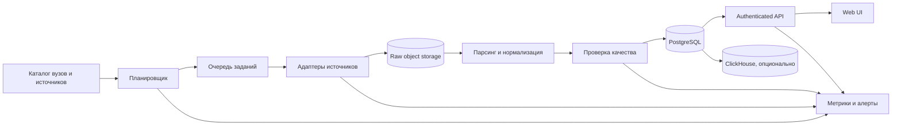

# Applicant Ranking List Analyzer

Сервис сбора и анализа конкурсных списков российских вузов. Основной пользовательский сценарий — по коду поступающего найти его позиции во всех доступных конкурсных группах и показать актуальность каждого результата.

> [!IMPORTANT]
> Сейчас репозиторий находится на стадии локального прототипа. Реализован только поиск по заранее добавленным CSV-файлам. Сбор данных, серверное API, база данных и пользовательский интерфейс пока отсутствуют.

## Цели проекта

- собирать публично доступные конкурсные списки из подтвержденного каталога источников;
- приводить разные форматы вузов к единой модели данных;
- хранить историю изменений списков и происхождение каждого снимка;
- находить все известные позиции поступающего по его коду;
- показывать бюджетные и платные конкурсы отдельно;
- измерять полноту покрытия и свежесть данных;
- не создавать открытый инструмент для массового перебора кодов поступающих.

## Границы проекта

Проект анализирует только законно и технически доступные источники. Он не должен:

- обходить CAPTCHA, авторизацию, ограничения частоты или другие механизмы защиты;
- собирать данные из личных кабинетов без официальной интеграции;
- заявлять 100% охват вузов России без доступа к официальному федеральному реестру конкурсных групп;
- публиковать исходные коды поступающих или предоставлять массовую выгрузку записей;
- считать опубликованные вузами сведения автоматически свободными от требований законодательства о персональных данных.

Реалистичная формулировка результата: «получено 97,4% подтвержденных публичных конкурсных групп каталога на указанное время», а не «получены все списки России».

## Текущее состояние

В репозитории реализован класс `Search` в `logic.py`:

- `add_info()` вручную регистрирует локальный CSV;
- `set_fast_mode()` загружает зарегистрированные таблицы в память;
- `set_slow_mode()` читает файлы при каждом поиске;
- `find_ab_info()` последовательно ищет код поступающего во всех таблицах.

Тестовые данные находятся в `data/` и содержат снимки нескольких конкурсных списков за июль 2026 года.

### Ограничения прототипа

- нет автоматического получения и обновления данных;
- поиск выполняется линейно по всем файлам;
- fast mode ограничен оперативной памятью одного процесса;
- отсутствуют схема и версионирование входных данных;
- имя файла не содержит полного набора метаданных конкурсной группы;
- ключ «вуз + бюджет/платно» не различает направления, филиалы, формы обучения и квоты;
- нет API, интерфейса, базы данных, тестов, CI/CD и мониторинга;
- CSV хранятся в Git, что не подходит для промышленного хранения снимков.

## Формат входных данных прототипа

Текущая реализация ожидает CSV с разделителем `;` и обязательной колонкой:

```text
Код поступающего
```

Схема реальных источников может меняться между вузами и даже между снимками одного источника. Промышленная версия не должна напрямую зависеть от названий колонок конкретного CSV: каждый формат обрабатывается версионированным адаптером и преобразуется к канонической модели.

## Использование локального прототипа

Требования:

- Python 3.11 или новее;
- `pandas`.

```bash
python -m venv .venv
source .venv/bin/activate
pip install pandas
```

Пример:

```python
from logic import Search

search = Search()
search.add_info(
    uni_path="data/example.csv",
    uni_name="Пример вуза",
    uni_degree="Бакалавриат",
    uni_is_budget=True,
)

result = search.find_ab_info(1234567)
print(result)
```

Это демонстрационный API. Его интерфейс и формат результата могут измениться после введения канонической модели.

## Целевая архитектура



### 1. Каталог источников

Каталог формируется на основе официальных реестров образовательных организаций и вручную подтвержденных страниц приемных комиссий.

Для каждого источника хранятся:

- вуз, филиал и официальный домен;
- приемная кампания и часовой пояс;
- URL и тип источника;
- ожидаемые конкурсные группы;
- тип и версия адаптера;
- допустимая частота запросов;
- сведения о `robots.txt`, условиях использования и правовом основании;
- дата последней ручной проверки и ответственный за адаптер.

### 2. Приоритет источников

1. Официальный договорной feed/API Сервиса приема или вуза.
2. Машиночитаемый CSV, XLSX или JSON на официальном сайте.
3. Статическая HTML-таблица.
4. Открытая динамическая страница, для которой требуется headless browser.
5. PDF как резервный и наименее надежный формат.

Headless browser не используется для обхода авторизации или технических ограничений.

### 3. Получение данных

Планировщик создает задания с учетом часового пояса и правил конкретного домена. Workers должны поддерживать:

- отдельный rate limit для каждого домена;
- jitter, повторные попытки и exponential backoff;
- circuit breaker;
- `ETag` и `If-Modified-Since`;
- контроль MIME-типа, размера и checksum;
- сохранение исходного ответа до парсинга;
- идемпотентность и защиту от повторной публикации одного снимка.

В активный период списки опрашиваются ориентировочно каждые 15–30 минут, но не чаще разрешенной источником частоты. Около дедлайнов частота повышается только по договоренности с владельцем источника.

### 4. Парсинг и контроль качества

Каждый адаптер преобразует исходный документ в каноническую схему. Результат публикуется атомарно только после проверок:

- наличие обязательных полей;
- корректность типов и допустимых значений;
- отсутствие дублей внутри одного снимка;
- последовательность мест в рейтинге;
- резкое изменение количества строк;
- исчезновение ранее существовавшей конкурсной группы;
- неизвестные статусы и изменение схемы источника.

Для каждого снимка сохраняются URL, время получения, время источника, checksum, версия парсера и результат валидации.

### 5. Хранилища

**S3-совместимое object storage в российском ЦОД**

- неизменяемые исходные ответы;
- шифрование;
- lifecycle policy и ограниченный срок хранения;
- возможность повторного парсинга после обновления адаптера.

**PostgreSQL**

- каталог и operational-данные;
- текущие и исторические снимки;
- индексы для поиска по поступающему и конкурсной группе;
- партиционирование по приемной кампании.

**ClickHouse — опционально**

- длительная история и аналитические запросы;
- подключается только после подтверждения, что возможностей PostgreSQL недостаточно.

Kafka также не является обязательной зависимостью ранней версии: для планировщика и очереди задач достаточно RabbitMQ или NATS.

## Каноническая модель данных

Основные сущности:

- `institution` — образовательная организация;
- `campus` — филиал или площадка;
- `admission_campaign` — приемная кампания и сезон;
- `source` / `source_endpoint` — происхождение данных;
- `competition_group` — отдельная конкурсная группа;
- `fetch_run` — попытка получения источника;
- `raw_object` — сохраненный исходный документ;
- `snapshot` — согласованное состояние списка на момент времени;
- `applicant_entry` — позиция поступающего в снимке;
- `parser_version` — версия адаптера;
- `validation_result` — результаты проверок;
- `coverage_expectation` — ожидаемый набор конкурсных групп.

Конкурсная группа должна различать:

- вуз и филиал;
- сезон;
- уровень и форму обучения;
- образовательную программу или многопрофильный конкурс;
- бюджетное или платное обучение;
- основной конкурс, особую, отдельную и целевую квоты;
- направление подготовки и профиль, если они определяют отдельный конкурс.

Код поступающего не считается глобально уникальным между приемными кампаниями. Для внутреннего поиска используется ключ вида:

```text
HMAC(season || applicant_code, secret)
```

Исходный код хранится только в ограниченной зашифрованной зоне, если это необходимо для выбранного пользовательского сценария.

## API и пользовательский интерфейс

Планируемые сценарии:

- поиск собственных позиций поступающего по введенному коду;
- просмотр текущего списка конкурсной группы;
- переход к другим найденным конкурсам этого поступающего;
- разделение бюджета, платного обучения и квот;
- отображение источника, времени снимка и признака устаревания;
- сравнение текущего состояния с предыдущим снимком.

Публичное API должно использовать authentication, rate limiting и audit log. Оно не должно поддерживать перебор диапазонов кодов или массовую выгрузку `applicant_entry`.

## Покрытие и надежность

Для каждого вуза и всей системы рассчитываются:

- количество ожидаемых и найденных конкурсных групп;
- доля успешно полученных групп;
- возраст последнего снимка;
- время последнего полного успешного прохода;
- количество источников с ошибками;
- группы, которые исчезли или перестали обновляться.

Основные эксплуатационные метрики:

- fetch success rate и latency по источникам;
- snapshot age;
- parser error rate;
- schema drift;
- необъяснимое изменение количества строк;
- дубли кодов и нарушения ранжирования;
- неизвестные статусы;
- размер очереди и длительность pipeline;
- coverage ratio;
- dead-man alert для каждого активного источника.

Гарантировать полный федеральный охват можно только при наличии официального manifest или интеграции с оператором Сервиса приема. Публичный web-scraping обеспечивает лишь измеряемое покрытие каталога.

## Безопасность и правовые требования

До промышленного запуска необходимы отдельное юридическое заключение и модель угроз. Минимальный набор требований:

- документированная цель и правовое основание обработки по 152-ФЗ;
- оценка необходимости уведомления Роскомнадзора;
- локализация первичной базы данных в России;
- минимизация собираемых и отображаемых полей;
- сроки хранения и автоматическое удаление данных;
- процедура обработки обращений субъектов данных;
- запрет обхода CAPTCHA, авторизации и rate limits;
- проверка прав на базы данных и условий использования каждого источника;
- RBAC, MFA для операторов и принцип наименьших привилегий;
- TLS, шифрование at rest и ротация ключей;
- журналирование административного доступа;
- резервное копирование и регулярная проверка восстановления;
- регламент реагирования на инциденты;
- отдельная оценка рисков для квот и других потенциально чувствительных признаков.

Стабильный код поступающего является квазиидентификатором: объединение списков разных вузов увеличивает риск установления личности. Обязательная публикация списка вузом сама по себе не снимает требований к его агрегации и повторному распространению.

## Структура репозитория

```text
.
├── data/       # тестовые CSV-снимки; не целевое production-хранилище
├── logic.py    # локальный прототип поиска
└── README.md
```

По мере развития планируется разделить проект на компоненты:

```text
src/
├── catalog/       # каталог вузов, источников и конкурсных групп
├── ingestion/     # scheduler, workers и адаптеры
├── normalization/ # каноническая модель и валидация
├── storage/       # репозитории и миграции
├── api/           # authenticated API
└── observability/ # метрики, трассировка и health checks
tests/
├── unit/
├── contract/      # фикстуры форматов вузов
└── integration/
```

## План развития

### Этап 0 — продуктовая и правовая рамка

- определить scope: публичные источники, партнерские вузы или федеральный охват;
- получить заключение по 152-ФЗ и правам на базы;
- выбрать пользовательский сценарий без публичного отслеживания людей;
- определить измеримые критерии полноты и свежести.

### Этап 1 — модель и локальный PoC

- ввести каноническую модель конкурсной группы и снимка;
- добавить provenance для существующих CSV;
- сделать версионированные парсеры и проверки данных;
- индексировать HMAC-код поступающего;
- добавить unit- и contract-тесты для текущих файлов;
- добавить `pyproject.toml`, lock-файл, линтеры и CI.

### Этап 2 — пилот ingestion

- собрать каталог 10–20 вузов с разными типами сайтов;
- реализовать адаптеры CSV/XLSX, JSON, HTML и PDF;
- добавить scheduler, очередь, retries и per-domain rate limits;
- реализовать атомарную публикацию снимков;
- создать dashboard свежести и покрытия;
- сверять результат с официальными страницами вручную.

### Этап 3 — production MVP

- реализовать authenticated API и web-интерфейс;
- добавить PostgreSQL, object storage и миграции;
- настроить RBAC, audit, шифрование и backup/restore;
- внедрить метрики, алерты и on-call runbooks;
- провести нагрузочное тестирование и проверку безопасности;
- внедрить правила хранения и удаления данных.

### Этап 4 — масштабирование

- развивать адаптеры для общих платформ вузов, а не отдельных страниц;
- назначить владельца и SLA каждому адаптеру;
- автоматизировать обнаружение schema drift;
- подключать договорные feeds для нестабильных источников;
- публиковать отчет о фактическом покрытии.

### Этап 5 — доказуемый федеральный охват

- получить официальный доступ или партнерство с оператором Сервиса приема;
- сверять каталог с федеральным manifest конкурсных групп;
- заявлять национальный охват только после автоматизированной сверки полноты.

## Нормативный контекст

В приемной кампании 2026 года конкурсные списки формируются отдельно по каждому конкурсу, публикуются на официальных сайтах образовательных организаций и на ЕПГУ и при наличии изменений обновляются не менее пяти раз в день.

Основные источники:

- [Порядок приема по программам бакалавриата, специалитета и магистратуры — приказ Минобрнауки №821](https://www.consultant.ru/document/cons_doc_LAW_491807/);
- [изменения к Порядку приема — приказ Минобрнауки №905](https://publication.pravo.gov.ru/document/0001202511280124);
- [Положение о суперсервисе «Поступление в вуз онлайн» — постановление Правительства РФ №89](http://pravo.gov.ru/proxy/ips/?docbody=&nd=603884331).

Нормативные требования и форматы источников необходимо повторно проверять перед каждой приемной кампанией.

## Лицензия

Лицензия проекта пока не выбрана. До добавления файла `LICENSE` использование и распространение кода регулируется действующим законодательством и разрешением правообладателя.
